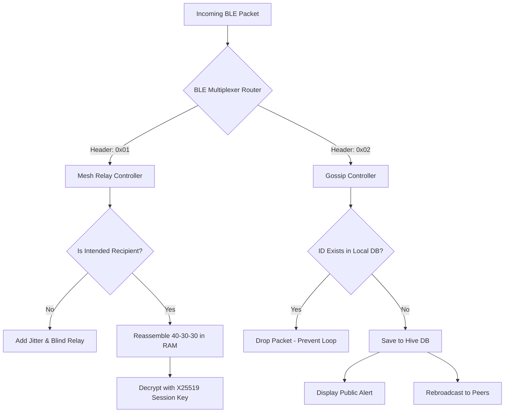

# Offline Mesh Communication 🛜

**Dual-Mode, Zero-Infrastructure Disaster Resilience in Your Pocket.**

When cellular towers fall and the internet goes dark, the Offline Mesh Communication app ensures that critical information still flows. Built for disaster zones, civil emergencies, and remote areas, this cross-platform native application creates a decentralized, peer-to-peer network using exclusively Bluetooth Low Energy (BLE)—with a bulletproof, dual-mode architecture.

## ⚔️ Dual-Mode Architecture

Our system acknowledges that not all emergency communications are identical. We engineered a proprietary **BLE Multiplexer** that inspects a 1-byte header on every incoming packet to route traffic between two distinct subsystems:

### 1. Secure Direct Mode (Tactical / Private)
*   **Targeted Routing:** `0x01` Header.
*   **Zero-Persistence:** Messages and keys exist **strictly in RAM**.
*   **Blind Relay:** Fragments are encrypted via **AES-256-GCM** and split 40-30-30. Middle-man devices relay the shards blindly, completely unable to read the contents.
*   **Air-Gapped Fallback:** Dense Base64/GZIP QR codes for manual offline exchange.

### 2. Public Alerts Mode (Gossip Protocol / Announcements)
*   **Targeted Routing:** `0x02` Header.
*   **Rumor Propagation:** Designed to flood the network. Plaintext JSON broadcasts bounce from device to device to quickly alert an entire camp or sector.
*   **Persistent Storage:** Saved locally in a Hive database so users have historical offline access to emergency alerts.
*   **Storm Prevention:** Instant ID-checking deduplication prevents infinite mesh echoing.

## 🏗 System Architecture Flow



## 🛠 How We Built It
- **Framework:** We used **Flutter** to ensure a single, highly performant codebase could deploy to both Android and iOS simultaneously. 
- **State Management:** **Riverpod** was utilized for strictly reactive UI rendering, separating the visual layer entirely from the cryptography and database layers.
- **Transport Layer:** We engineered a custom BLE GATT layer using `flutter_blue_plus` (Client) and platform channels (Server) to bypass standard iOS/Android peripheral limitations.
- **Cryptography:** We implemented a custom Libsodium-equivalent stack utilizing `cryptography` in Dart.

## 🛡 The Security Model
We engineered the secure mode around a **Zero-Persistence** philosophy:
1. **RAM-Only Execution:** Private messages and derived session keys are never written to disk.
2. **Ephemeral Identity:** Nodes rotate their broadcasting UUID and public keys every 30 seconds.
3. **Wipe & Exit:** A prominent kill switch allows users to instantly zeroize all active memory buffers and terminate the app.
4. **Strict Segregation:** The `DatabaseService` is physically isolated from the `MeshRelayController`, guaranteeing a public database can never intercept a private fragment.

## 🚧 Challenges We Ran Into
- **BLE Payload Limits:** Standard BLE packets are capped at 20 bytes. We had to programmatically negotiate an MTU of 512 bytes to transmit encrypted ciphertext.
- **Broadcast Storms:** In a mesh, infinite echoing is a fatal flaw. We solved this with a SQLite/Hive ID check for public alerts, and a fast SHA-256 hash check for secure fragments.
- **Cross-Platform Peripheral Mode:** iOS and Android handle GATT server advertising vastly differently. We had to write native Kotlin MethodChannels to properly expose the write-characteristics.

## 🚀 Setup & Build Instructions

### Prerequisites
- Flutter SDK (>= 3.0.0)
- Physical Devices required (BLE mesh cannot be tested on emulators)

### Android
```bash
flutter pub get
flutter build apk --release
```

### iOS
*Note: Requires an Apple Developer Account with Bluetooth capabilities enabled.*
```bash
flutter pub get
cd ios
pod install
cd ..
flutter build ios --release
```
